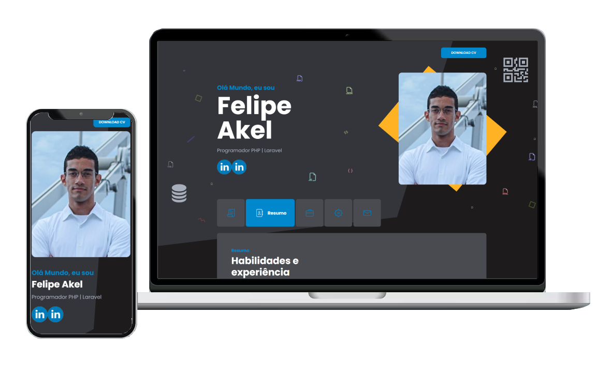

## Sobre o Portfolio Felipe Akel em Laravel

> [!CAUTION]
> Sistema em fase de Desenvolvimento

O Portifólio Felipe Akel trata-se de um website desenvolvido em PHP Laravel com o objetivo de apresentar as informações do desenvolvedor, Felipe Akel. 

Destaca-se, que o sistema é composto de 2 layouts distintos responsáveis por montar o front-end dos ambientes. Primeiro, trata-se de área dos internautas de livre acesso. Segundo, trata-se da área administrativa do portfólio o qual possibilita o gerenciamento das informações do website. Com isso, o projeto desenvolvido em Laravel ganha autonomia para ações de _CRUD - Create, Read, Update, Delete_. 

### Área dos Internautas
- Resumo [IMG](public/readme/resumo.png)
- Em breve todas as telas...

### Área Administrativa
- Sobre Mim [IMG](public/readme/sobre-mim.png)
- Dashboard [IMG](public/readme/cadastro-portfolio.png)
- Em breve todas as telas...

## Tecnologias utilizadas

### Laravel
- **[Laravel Versão 8.x](https://laravel.com/docs/8.x)**

### Sistema de Gerenciameto de Bando de Dados - SGBD
O Banco de Dados utilizado foi o [MySQL Workbench](https://www.mysql.com/products/workbench/). O Sistema utilizar um **Banco de Dados Relacional** e para criação das tabelas foi utilizado as **Migrations do Laravel**, o atual **Modelo de Dados** pode ser acesso no link [Banco de Dados Relacional](public/readme/banco-relacional.png).

### Composer
Gerenciador de dependências do PHP. Necessário ter instalado para atualizações e inclusões de novos pacotes no sistema.
([Documentação](https://getcomposer.org/))

### Tema área do internauta: iKnow
[iKnow](https://themeforest.net/item/iknow-cv-resume-template/34225451) é o template utilizado na Área dos Internautas.

### Tema área administrativa: Bootstrap
[Bootstrap 5](https://getbootstrap.com/) é o template utilizado na Área Administrativa.

## Construção do Ambiente Local

Primeiramente, é essencial clonar o repositório para sua máquina e abrir o terminal, prompt de comando, no diretório na pasta do projeto. Com isso, podemos seguir o passo a passo a seguir:

    - [ ] \(Optional) No terminal execute 'composer install';
    - [ ] \(Optional) Faça uma cópia do arquivo '.env.example' para '.env' na pasta do projeto.
    3. SGBD utilizado 'MySQL': Crie um banco de dados chamado 'bd_portfolio_felipe_akel';
    - Por exemplo, pode-se utilizar o Xampp para acessar o phpMyAdmin ('http://localhost/phpmyadmin') e criar a database;
    4. No terminal execute 'php artisan key:generate';
    5. No terminal execute 'php artisan migrate' para criar as tabelas;
    6. No terminal execute 'php artisan db:seed' para carregar os dados nas tabelas;
    7. No terminal execute 'php artisan storage:link' para gerar um link simbólico na pasta 'public';
    8. No terminal execute 'php artisan serve' ou 'php artisan serve --port=8080';
    9. Pronto! Você deve conseguir acessar o endereço criado ('http://127.0.0.1:8000') ou na porta configurada.

> [!IMPORTANT]
> Para logar na área administrativa clique no link 'Login' localizado no canto direito inferior da tela ou ('http://127.0.0.1:8000/login').
> **Login**: 'felipe.florentino', **senha**: '0123456789'

Para configurar o envio de e-mail do Portfólio Felipe Akel, é essecial seguir o passo a passo abaixo:

    1. Necessário ter uma conta Gmail com autenticação de 2 fatores ativas.
    2. Acesse as configurações de sua conta:
    2.1. Busque por "Senhas de app", geralmente está dentro de "Verificação em duas etapas", crie um registro com o nome Portfólio Felipe Akel, por exemplo. Copie/salve a senha gerada.
    3. Abra o arquivo .env e altere o valor contido na variável:
    3.1. 'MAIL_HOST=smtp.gmail.com', atualize para este dado;
    3.2. 'MAIL_PORT=1025', altere para esta porta;
    3.3. 'MAIL_USERNAME=SEU_EMAIL@gmail.com', coloque o e-mail responsável por enviar as mensagens aos usuários.
    3.4. 'MAIL_PASSWORD=SENHA_GERADA_GMAIL', coloque a senha gerada do Gmail, não coloque espaços.
    3.5. 'MAIL_ENCRYPTION=tls', atualize para este dado;
    3.6. "MAIL_FROM_ADDRESS='SEU_EMAIL@gmail.com'", repita o e-mail responsável por enviar as mensagens aos usuários dentro de aspas simples.
    

## Vulnerabilidades de segurança

Se você descobrir uma vulnerabilidade de segurança do sistema, envie uma mensagem para Felipe Akel via [Linkedin](https://www.linkedin.com/in/felipe-akel-carvalho-florentino-009412135/). Todas as vulnerabilidades de segurança serão verificadas. Obrigado!

## Licença

Este Portfólio desenvolvido em Laravel utiliza a licença MIT.